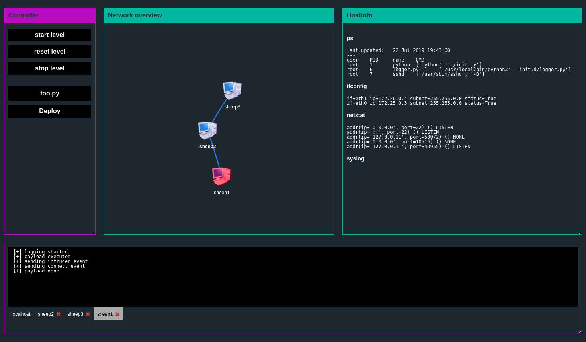

# intruder.py

A game where you need to create an automated script that tries to compromise multiple targets in a network. 

It uses docker as the backend to run the interface as well as the hosts within the level.

